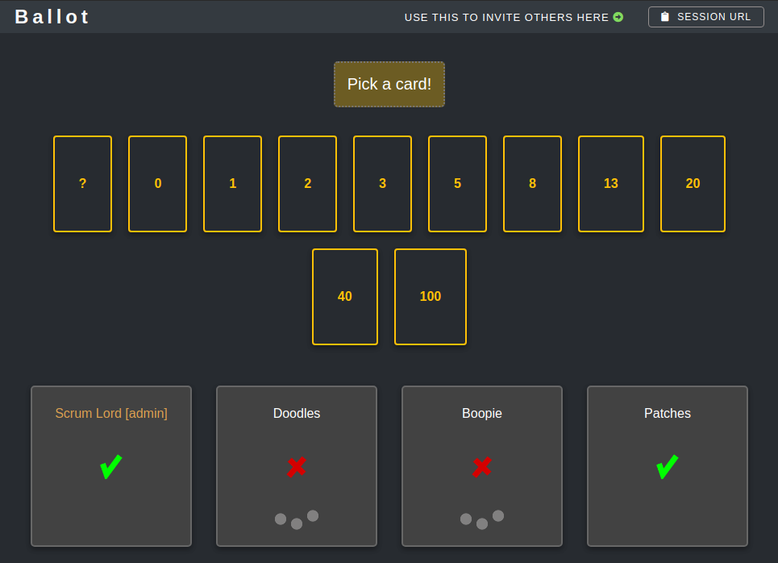

# Ballot 

A web-based replacement for physical Scrum estimation cards, most useful for distributed teams. 



## It's live
[Try it here](https://ballot.renegadeotter.com/#/)

## Features

- A vote will end automatically when all votes are in
- A vote can be finalized even if someone doesn't vote, because they are raiding the company fridge
- If you are not a pig, you can join and observe an estimation session as a chicken

## Stack:
* Go HTTP server
* React/Typescript UI
* Redis for session state
* Glue.js for WebSocket communication
* 
## Installing and running

With DockerHub:

    docker pull papito/ballot:latest
    docker run -td -p8080:8080 --name ballot papito/ballot:latest

With external Redis:

    docker pull papito/ballot:latest
    docker run -td -p8080:8080 --name ballot -e"REDIS_URL=..." papito/ballot:latest

## Development setup

### Prerequisites
  * Docker Compose
  * Node 18
  * Go 1.21

### Starting up development

If you are special and don't have Make installed on your system, just
look at the Makefile and run the commands manually.

#### Server

```bash
# Start the dockerized Redis (in a different window)
make db
# Compile & run the Go server
make start
```

#### Client
```bash
cd ballot-ui
make install
make start
```

`IMPORTANT`: In development, the Go and the React apps run separately. 
The Go server runs on port 8080 and the React app proxies requests to the Go server. If you access
the app on port 8080 in development, you will be accessing the **build** (production) version of the React app.

### Running server tests

    make test

### Running UI tests

    cd ballot-ui
    make test
    # run a specific test
    npx jest -t '<partial test name to match>'


### PRE-COMMIT HOOK

In `.git/hooks/pre-commit `:

    #!/bin/sh
    cd ballot-ui
    make format
    make lint


### Build & run with Docker

`docker build . -t ballot`
`docker run -td -p8080:8080 --name ballot ballot`

Note that this will install local Redis in the container, but that instance can be ignored if you configure Redis with environment variables (see below).

### Environment variables

  * HTTP_PORT - dictates which port the application will run on.
  * REDIS_URL - Redis URL. If not provided, will connect to Docker Redis on the port 6380.
  * ENV - context environment. `test`, `development`, or `production`. You can ignore this.


### Connecting to Redis on Docker host

By default, the Docker container will have its own Redis instance, but you can have a persistent Redis running on Docker
host, by using the `--network="host"` flag of Docker `run` command.

## Redis schema

#### ballot:user:{user_id} -> Hash

User state for a session is stored here, and yes, this assumes that a user can only vote in one session.

| Field       | Type                  |
|-------------|-----------------------|
| id          | UUID                  |
| name        | String                |
| estimate    | String                |
| joined      | String (datetime)     |
| is_observer | Flag                  |
| is_admin    | Flag                  |

`estimate` is an empty string by default.

`joined` is used to sort users in a session by the order in which they had joined.

#### ballot:session:{session_id}:users -> Set[String]

A set of users in this current session.

#### ballot:session:{session_id}:observers -> Set[String]

A set of observers in this current session.

#### ballot:session:{session_id}:vote_count -> Int

Number of users in a session who cast a vote.

#### ballot:session:{session_id}:tally -> String

Final vote tally.

#### ballot:session:{session_id}:voting -> Int

  * 0 - Not voting (idle before start, or vote finished)
  * 1 - Voting
